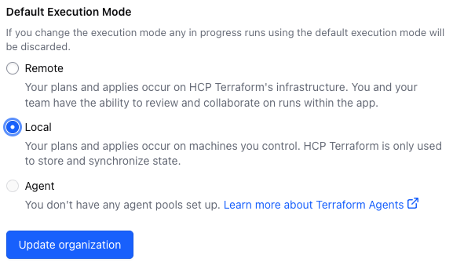

# Terraform Setup for BTP Trial

Right now this terraform setup creates:

- Import the subaccount named 'trial'
- Add entitlements for
  - Alert Notification
  - SAP Build Work Zone, standard edition
  - SAP Cloud Identity Services
  - HANA Cloud tools
  - HANA Cloud
- Create an instance of
  - SAP Build Work Zone, standard edition
  - SAP Cloud Identity Services
  - HANA Cloud tools
  - HANA Cloud
- Add trust to the SAP Cloud Identity Services instance

## References

- [Terraform Provider for SAP BTP](https://registry.terraform.io/providers/SAP/btp/latest/docs)
- [btp-terraform-samples](https://github.com/SAP-samples/btp-terraform-samples/)

## Prerequisites

### BTP Trial account

Must be created in region `us10`.

### Terraform

Register at [Terraform Cloud](https://app.terraform.io/signup/account) and create a new organization. Navigate to this organization and open the settings. For the Default Execution Mode choose `Local`:



### GitHub Codespace

Create a new GitHub Codespace by clicking on the green button in the repository, choose the tab Codespaces and click on create. This will create a new Codespace with the required tools. If you want to use the Codespace in your local VS Code you can configure this as a preference using https://github.com/settings/codespaces.

### Setup inside the Codespace

Create a new branch with the name of your terraform organization.

Change the file `terraform.tf` and replace the `organization` with your organization name.

Create .env file in the root directory with the following content:

```bash
TF_VAR_subaccount_id='<Your-trial-Subaccount-ID>'
TF_VAR_subdomain='<Your-Subdomain>'
TF_VAR_admins='["<Your-E-Mail-Address>"]'
TF_VAR_hana_system_password='<Your-HANA-System-Password>'
BTP_ENABLE_SSO='true'
```

then run

```bash
export $(xargs <.env)
```

to load the environment variables. Now you can run the terraform commands.

## First time usage

> [!IMPORTANT]
> When you use this repository for the first time on a freshly created BTP Trial account then you need to uncomment the import lines in the `main.tf` file.

## Usage

Authenticate to Terraform Cloud:

```bash
terraform login
```

Install the required providers:

```bash
terraform init
```

See what will be created:

```bash
terraform plan
```

Create the resources:

```bash
terraform apply
```
